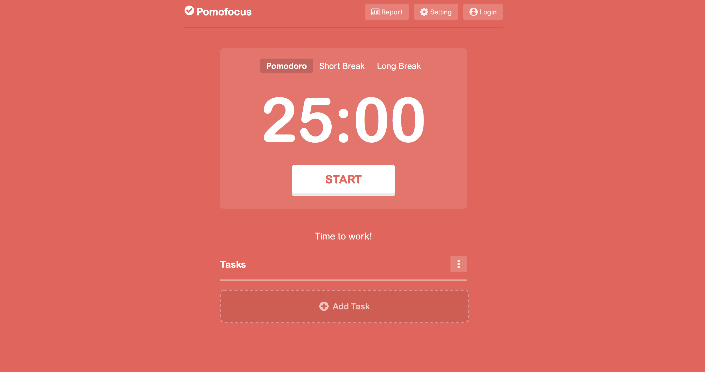

[![Contributors][contributors-shield]][contributors-url]
[![PR][pr-shield]][pr-url]
[![Issues][issues-shield]][issues-url]
[![Forks][forks-shield]][forks-url]
[![MIT License][license-shield]][license-url]

  <h3 align="center">Project: POMOFOCUS</h3>

  

    Let's start to explore the project 🚀 
     
    <a href="https://github.com/IrynaSpyrydonova/pomofocus"><strong>Check the docs 📄</strong></a>
     
    <a href="https://irynaspyrydonova.github.io/pomofocus/">View Demo 💡</a>
    ·
    <a href="https://github.com/IrynaSpyrydonova/pomofocus/issues">Report Bug 🐞</a>
    ·
    <a href="https://github.com/IrynaSpyrydonova/pomofocus/pulls">Request Feature ⚒</a>
  

## Table of Contents

- [About the Project](#about-the-project)
  - [Built With](#built-with)
  - [Debuggers](#debuggers)
- [Contributing](#contributing)
- [License](#license)
- [Contact](#contact)
- [Acknowledgements](#acknowledgements)

## About The Project

The main idea of this project is to practice and understand the concepts of Asynchronous Programming, usage of Classes, `setTimeout` and `setInterval`. 

### Built With

- [Visual studio code](https://code.visualstudio.com/)
- [GitHub](https://github.com)
- [JavaScript](https://www.javascript.com/)

## Debuggers

- Chrome developer tool
- Visual Studio Code debugger

## Contributing

1. Fork the Project
2. Create your Feature Branch (`git checkout -b new-branch`)
3. Commit your Changes (`git commit -m 'Add some AmazingFeature'`)
4. Push to the Branch (`git push origin new-branch`)
5. Open a Pull Request

<!-- LICENSE -->

## License

Distributed under the MIT License. See [LICENSE](https://github.com/IrynaSpyrydonova/pomofocus/blob/master/LICENSE) for more information.

<!-- CONTACT -->

## Contact

- [Mamé](https://github.com/mametur)
- [Iryna Spyrydonova](https://github.com/IrynaSpyrydonova?tab=repositories)
- [Nadia](https://github.com/ms-np?tab=repositories)
- [Ali Abdulhamid](https://github.com/ali1996-sy?tab=repositories)
- [Pavel](https://github.com/pavelbidenko2018?tab=repositories)

<!-- ACKNOWLEDGEMENTS -->

## Acknowledgements

- [HYF](https://hackyourfuture.be/)
- [BEST readme template](https://github.com/othneildrew/Best-README-Template/blob/master/README.md)

<!-- MARKDOWN LINKS & IMAGES -->
<!-- https://www.markdownguide.org/basic-syntax/#reference-style-links -->

[contributors-shield]: https://img.shields.io/badge/5-Contributors%20-brightgreen
[contributors-url]: https://github.com/IrynaSpyrydonova/pomofocus/graphs/contributors
[forks-shield]: https://img.shields.io/badge/-Forks-blue
[forks-url]: https://github.com/IrynaSpyrydonova/pomofocus/network
[issues-shield]: https://img.shields.io/badge/-ISSUES-green
[issues-url]: https://github.com/IrynaSpyrydonova/pomofocus/issues
[pr-shield]: https://img.shields.io/badge/-Pull%20Requests%20-blue
[pr-url]: https://github.com/IrynaSpyrydonova/pomofocus/pulls
[license-shield]: https://img.shields.io/badge/-LICENSE-brightgreen
[license-url]: https://github.com/IrynaSpyrydonova/pomofocus/blob/master/LICENSE